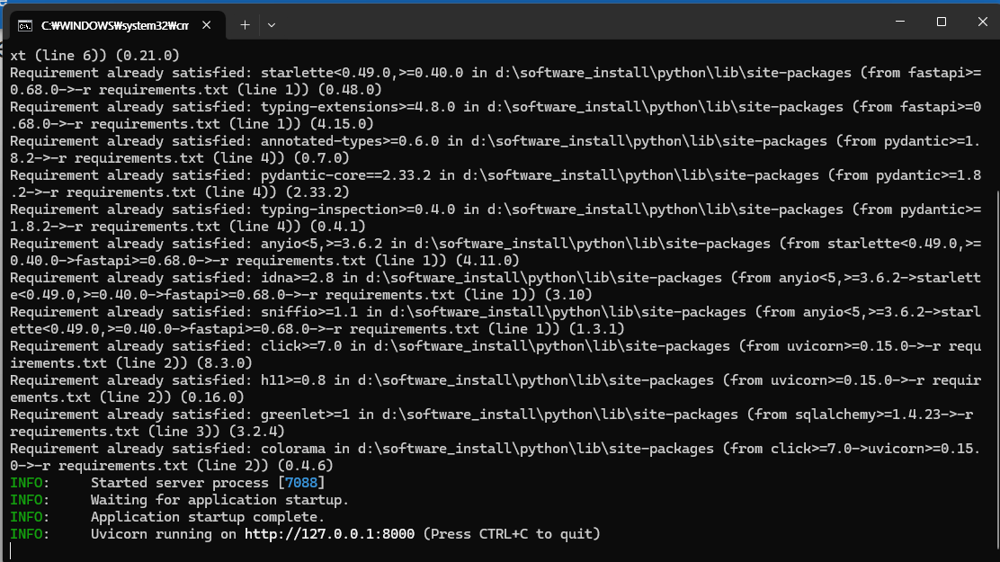

# dho joy 오프라인

dho joy 에 올라간 정보를 오프라인으로 서버를 직접 띄워서 사용하는 프로그램

**스크린샷**


> [!CAUTION]
> dho joy 의 모든 데이터를 수집하지 못하여 모든 정보를 검색할 수는 없습니다. 현재 퀘스트,발견물,도시,침몰선,보물지도,선박 탭만 구현이 되어 있습니다. 이마저도 아직 joy 처럼 다른 테이블에 있는 데이터를 다 긁어와서 추가정보를 종합하여 보여주는 방식은 아닙니다. 초기베타버전이라고 생각해주세요

## 설치 및 사용

:warning: python 설치 부분은 매우 대충 넘어감

윈도우11 환경

### python 설치

https://www.python.org/downloads/windows/ 에서 윈도우 설치 파일 받아서 설치


꼭 스샷 처럼 3.13.7 일 필요 없습니다. 링크 들어가셨을 때 보이는 최신 버전의 windows installer 다운받아서 설치하시면 됩니다.


#### (선택) 파이썬 설치 후 실행 되는지 확인

윈도우 powershell을 열어서 python을 입력해서 실행해봅니다
아래와 같이 보인다면 python 이 설치가 되고 powershell/cmd 에서 실행이 가능하다는 것입니다.


### 코드 다운로드

git clone 혹은 zip 파일 다운로드.

```
git clone https://github.com/tempuser12347/nojoy
```

OR

zip download url: https://github.com/tempuser12347/nojoy/archive/refs/heads/main.zip
여기에서 zip 파일 다운로드 후 압축을 해제합니다

### `win_run_server.bat` 파일 실행

압축해제된 폴더에서 `win_run_server.bat` 파일을 실행합니다.
python이 설치가 되었다면 이 스크립트로 필요한 파이썬 패키지를 설치하고 nojoy 서버를 실행하는 작업을 합니다.




기본적으로 8000번 포트에 실행됩니다.

브라우저를 켜고 `http://localhost:8000` 으로 가면 사용 가능합니다.

----

## 데이터베이스

기본이 되는 데이터를 이미 작업해준 https://github.com/dhosql/dhoSQL 에서 가져온 db를 활용하였습다다.

가져온 db에서 한글 column 을 영어로 바꾸는 작업, 추가 table 대충이라도 생성하는 등의 수정을 가했습니다.

이후에 dhodb.com 을 크롤링하여 데이터를 지속적으로 추가하고 있습니다. dhodb.com 크롤링 중에도 특정 페이지는 로그인에 막혀서 제대로 수집을 못하는 경우들이 발생하여 dhodb.com 데이터 100%를 가져왔다고 하기는 어렵습니다. 그래도 한 80-90% 정도는 가져오고 있는 것 같습니다.

db 파일은 `dhoDatabase.sqlite3` 파일입니다.


